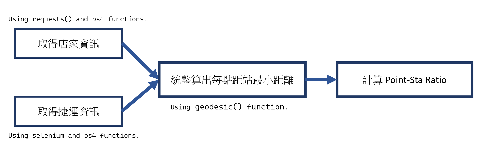
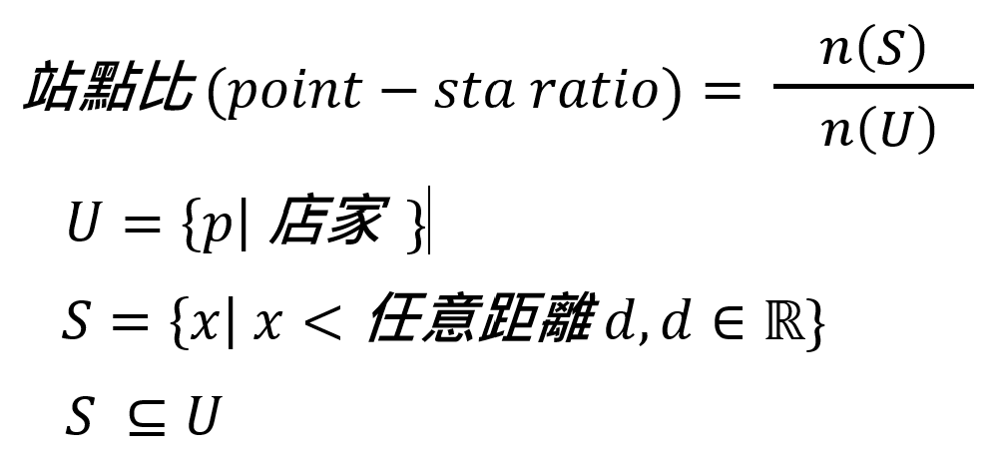

# Resterunt Point-Sta Ratio (update 2023/07/06)


- [Resterunt Point-Sta Ratio (update 2023/07/06)](#resterunt-point-sta-ratio-update-20230706)
  - [Result](#result)
  - [Big Picture](#big-picture)
  - [declare](#declare)
  - [Good to know (file or program habit)](#good-to-know-file-or-program-habit)
  - [0. Code for all process:](#0-code-for-all-process)
  - [1. resterunt search](#1-resterunt-search)
    - [I. processed resterunts](#i-processed-resterunts)
    - [II. methods:](#ii-methods)
      - [Overall:](#overall)
      - [i. subway](#i-subway)
    - [III. code:](#iii-code)
  - [2. Metro search](#2-metro-search)
    - [I. methods:](#i-methods)
      - [Overall:](#overall-1)


## Result


## Big Picture


## declare



## Good to know (file or program habit)

ALL CSV filename : 
- {resterunt_name/MRT}_({place})_data.csv # get data 
- {resterunt}_({place})_MRT_distance.csv   # processed data
    Above, only one file. "()" is optional.
- result.csv # result data (final data)


## 0. Code for all process:
```python
    # write to file
    def write_to_file(filename, text):
        file = open(filename, "w", encoding="utf-8")
        file.writelines(str(text))
        file.close()
```


## 1. resterunt search
### I. processed resterunts
    - (a.) subway
    - (b.) mcdonalcs
 

### II. methods:
#### Overall:
透過爬蟲技術取得官網上店家資訊
#### i. subway
透過爬蟲上 [Subway 官網](https://subway.com.tw/GoWeb2/include/index.php?pageNum_content01=0&totalRows_content01=44&select=index.php%3FPage%3D2&address=台北市&Page=2&Cate01=&Cate02=&Cate03=) 取得各店地址，寫入本地 "Subway_data".csv

        
### III. code: 

```python
def find_target(output_data):
    global count
    stores_name = soup.find_all("td", class_="store-name")
    stores_loc = soup.find_all("td", class_="store-where")
    for store_name, store_loc in zip(stores_name, stores_loc):
        name = store_name.text.strip()
        location = store_loc.text.strip()
        output_data[count][0] = name
        output_data[count][1] = location
        count += 1
```


## 2. Metro search
### I. methods:
#### Overall:
透過爬蟲將資料取得117站經緯度，儲存成csv檔
